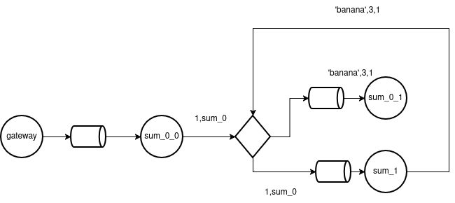

# Sistemas Distribuidos I
# Lisandro Román 
# Padrón: 107274

# Introducción

El presente trabajo se busca resolver el problema de la intercomunicación entre varios nodos de computadoras corriendo codigo de forma concurrente/paralela para resolver un mismo problema.

# Desarrollo

Según la arquitectura planteada por la cátedra, implica la comunicación de distintos nodos que pueden estar corriendo el mismo o distinto código para resolver una tarea que a priori se iría particionando. Esta arquitectura, plantea el desafío de sincronizar distintas computadoras para llegar a un objetivo en común, funcionar como una sola habiendo dividido el cómputo. Por lo tanto, los nodos en cuestión, estarían ejecutando código como, suma, ordenamiento y agrupación de esto se encargarían los nodos sums, aggregator y join respectivamente. Este enfoque implica que las instancias del mismo código coordine entre ellas y con las posteriores y anteriores. De esa forma la solución que se desarrollo fue la descripta a continuación.

## Rol y Relacion entre SUMs

Habiendo mencionado la relación entre elementos pares y anteriores y posteriores primero me dentendre en los SUMS. A esta instancia le llega un mensaje filtrado por cliente_id. Una instancia de sum puede procesar 1 mensaje a la vez. Sabiendo esto, cuando llega un mensaje de que la información que se está enviando ha finalizado, lo leera sólo una instancia de los sums con lo que implica que el resto, nunca se enteraría y en ese momento es donde entra en juego la coordinación de los nodos pares.
Para resolver el problema de coordinación se colocó un exchange entre ellos. Esto implica que se lance un hilo SUM_0_1 (el hilo principal lo denomino Sum_0_0) que está consumiendo de una cola propia y puede recibir 2 tipos de mensajes. 
El primer mensaje significa que tiene que comunicarle a otro SUM todos los datos que tenga de determinado cliente o que sume las distintas ACK de sum hasta que iguale todas las instancias que hay en mi sistema, para saber cuando debo comunicarme con el siguiente nodo. Con lo cúal el mensaje puede ser interpretado de 2 formas, si me llega [client_id,sum_id] y ese sum_id != ID, entonces me piden que envié información, mientras que si me llega [client_id, sum_id] y sum_id == ID, signfica que uno de los sums terminó de enviar información. No me interesa quién, simplemente me interesa saber que todos hayan terminado, con lo cual realizo una suma de todos los EOF recibidos y debe coincidir con la SUM_AMOUNT de esa instancia.
El segundo tipo de mensaje, son las frutas y cantidades de cliente pedido a otros sums. 
Esto implica que la informacion que manipula el SUM puede caer en una race condition entre el hilo principal y el hilo alterno que recibe informacion de los otros pares. 
Para solucionar este problema, se encapsuló en un Monitor el diccionario de clientes con frutas permitiendo que los hilos lo modifiquen de manera sincronizada. 
A su vez, tambien tengo que determinar cuando los otros sums terminaron de enviar su información para ello tengo que realizar un recuento. Una vez terminado el recuento, se determina el aggregator al que irá determinado cliente con una funcion muy simple de hash, ya que lo pide la consigna, no realizar broadcast.
Este recuento también está protegido por un monitor que garantiza la sincronización aunque no sería necesario ya que el otro hilo SUM_0_0 nunca deberia ejecutar ese código ya que no recibe nunca un mensaje del estilo [client_id,sum_id] pero eventualmente si lo hiciera y por alguna razón debería incrementar este contador, el mismo se encuentra protegido (puede ser un poco overhead pero al tener 2 hilos de la misma instancia es preferible realizar una sincronización en dicho caso)

En caso de que llegue el mensaje enviar información de tal cliente, puede que la otra instancia de sum este procesando un mensaje de ese cliente, con lo cual, se guarda el cliente con el que se está interactuando y solamente se permite acceder a la información una vez que se hayan terminado de hacer arreglos, para no enviar informacion corrupta. 

Puede que haya mas información de ese cliente además de la que estoy procesando?
No, se supone que si la hay, está en otro sum, ya que, como se mencionó anteriormente, los mensajes se consumen de a 1 y se los procesa, si habia más mensajes, fue consumido por otra instancia y eventualmente esa instancia se ocupará de la sincronización de los datos.

Con esta implementación garantizamos que todos los sums cuando reciben la información de sus pares, realicen una suma total de esa fruta de ese cliente. De esta manera cuando lo envio al aggregator, este no tiene nada para sumar, porque ya recibio la suma total de esa fruta.

# Ejemplo
En la siguiente imagen podemos observar como llegado a la instancia principal del sum, se recibe un eof del cliente 1 y este se encarga de iniciar el proceso entre sums para solicitar toda la informacion requerida sobre ese cliente con el mensaje:  1, sum_0
De esta manera, los sums saben de que cliente se quiere la información y a quien hay que enviarsela.
Cómo explique más arriba, el cliente 1,sum_1 si entrara por la cola que esta absorviendo sum_1, este interpretaría que uno de los sums terminó y puede realizar la suma de que uno más finalizó transmitiendo la información con ese cliente.

    

## Rol de los Aggregator y Join
En esta solución, los aggregators, simplemente reciben la informacion de cada cliente y la almacenan de forma ordenada. Una vez llegado el eof de ese cliente, se procede a enviar el TOP al join

Este último simplemente realiza un pasamanos, es decir deposita en la cola, el top recibido.

# Ventajas y Desventajas de la solución

En esta solución para que los aggregator simplemente tengan que ordenar la información y no tengan que coordinarse, se optó por una funcion que destina el flujo de un cliente hacia una instancia del aggregator mendiante un mod ( client_id % AGGREGATION_AMOUNT ). De esta manera cuando toda la data de ese cliente fue recibida por un sum, este envía la información del mismo por un solo flujo y no se dispersa la información. La ventaja que tiene es justamente esto último, al no dispersar la información, los aggregators no tienen que coordinarse, ya que el eof sólo le llega a 1 de ellos y esto reduce la latencia. También beneficia en terminos del join, ya que simplemente realiza un pasamanos y este último punto de la arquitectura podría saltearse reduciendo un nodo. La desventaja principal es que, depende de la data del cliente, es decir, puede que un cliente tenga mucho datos y otro una cantidad significativamente menor de forma que entonces, las instancias de los aggregators quedaría desbalanceadas. En ese caso, hay un aggregator realizando mucho cómputo mientras que el resto ya finalizó. Igualmente el balanceo de carga siempre depende de la información de los clientes, pero si se utilizaría una funcion de hash por fruta por ejemplo y cada aggregator se encargase de ordenar simplemente, dependería de las frutas que haya enviado el cliente y puede quedar más uniforme la distribución de la carga, pero depende siempre de la información que llegue.

# Conclusión

Existen diversos enfoques para abordar la solución frente a la arquitectura propuesta, como lo mencionado anteriormente, cada una de ellas tiene ventajas y desventajas dependiendo principalmente del cluster de computadoras que tengas y el cómputo que estás realizando. Intuitivamente podría decirse que, si tu capacidad de cómputo no es muy buena pero tenés varios nodos para aprovechar, probablemente quieras abordar la solución de una manera que, si bien tenés más latencia, diversifiques más el cómputo y el join no sea simplemente un pasamanos, mientras que la solución propuesta, implica que si tenés pocas máquinas y mejor cómputo, probablemente quieras ahorrar latencia para resolver el problema más rápidamente. Lo que termina de concluir en, dependiendo del problema y circunstancias, una solución podría ajustarse más o menos al caso.

